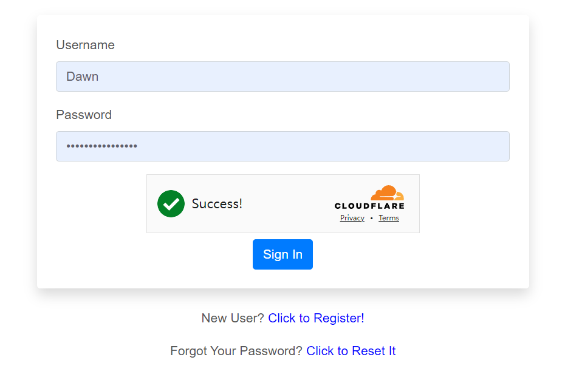
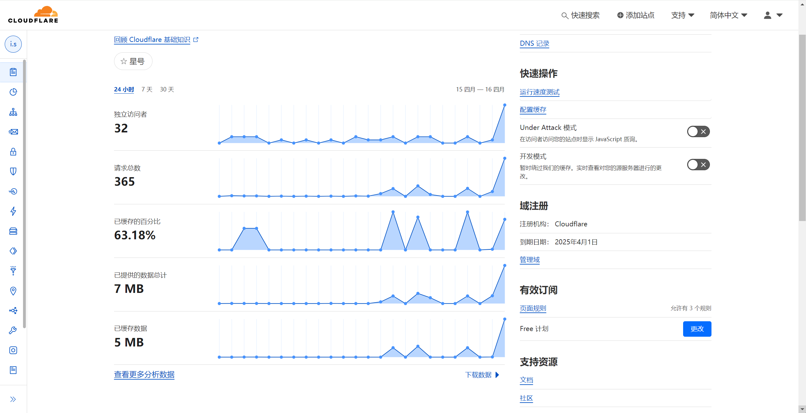
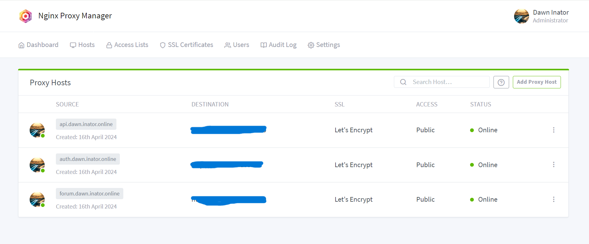
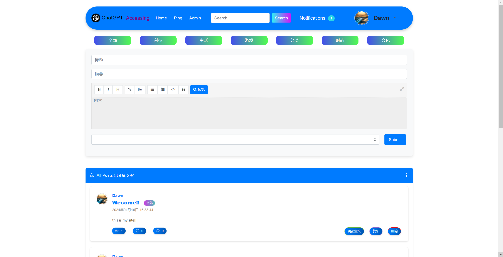
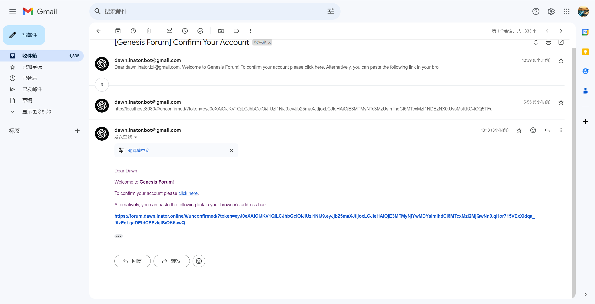
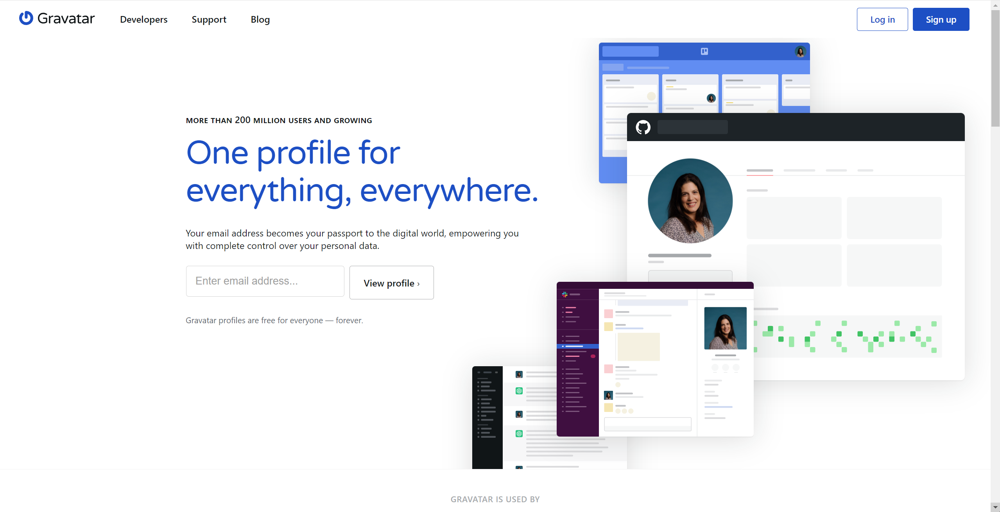
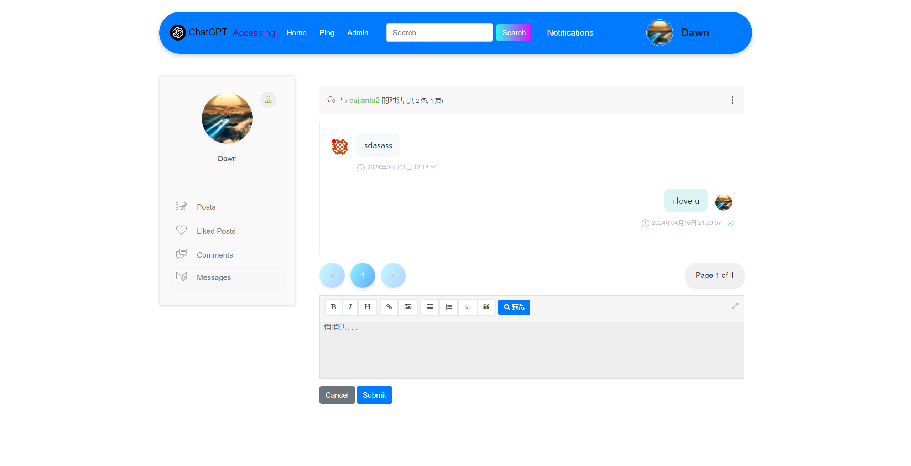
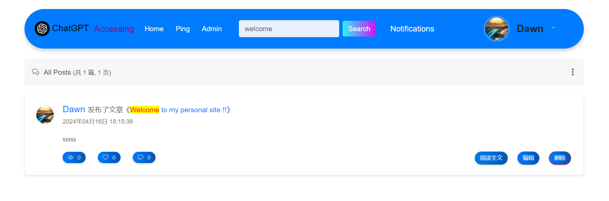
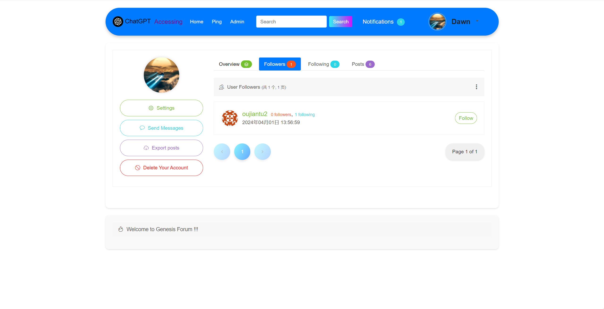

---

<p align="center">
  <h2 align="center">Genesis Forum</h2>
  <p align="center">
    一款使用vue和flask搭建的文章论坛！
    <br/>
    <br/>
    <a href="#🎉基础介绍"><strong>» 开启我的旅行 »</strong></a>
    <br/>
  </p>
</p>

<p align="center">
  <a href="https://github.com/Dawn-Inator/Genesis-Forum/stargazers"></a>
  <a href="https://github.com/Dawn-Inator/Genesis-Forum/actions/workflows/docker-latest.yml"></a>
  <a href="https://hub.docker.com/r/Dawn-Inator/Genesis-Forum/"></a>
  <a href="./LICENSE"></a>
</p>

---

## 🎉基础介绍

**⚡ 支持**   
* [x] 用户注册/登录/退出
* [x] 个人主页与用户头像
* [x] 博客文章CURD与Markdown
* [x] 粉丝关注大神
* [x] 用户评论
* [x] 用户通知
* [x] 私信  
* [x] 黑名单
* [x] 喜欢文章
* [x] 邮件支持
* [x] 权限管理
* [x] 多任务后台
* [x] 全文搜索
* [x] 国际化
* [x] SSL证书和https加密
* [x] 可视化UI管理域名和流量

<br>

||||
|:---:|:---:|:---:|
||||
||||
||||
||||
||||

<br>

**🤖 三种方式的搭建**

| 方式 | Linux基础搭建 | Linux转Docker进阶搭建 | Docker一键部署 | 
|:---:|:---:|:---:|:---:|
| 使用分支 | linux分支 | linux分支 | docker分支 |
| 搭建难度 | 困难 | 普通 | 简单 |
| 域名一键管理 | 不支持 | 支持 | 支持 | 
| 申请SSL证书 | 手动部署 | SSL一键部署 | SSL一键部署 |
| 支持Cloudflare功能 | 支持 | 支持 | 支持 | 

<br>

## 🎡搭建环境


|配置|需求|
|---|---|
|vCPU|2+|
|内存|4GB+|
|存储|10GB+|

## 📖服务器与节点选择

<h3><a href="https://aws.amazon.com/" target="_blank"><b>Amazon Web Services</b></a></h3>

*Amazon Web Services (AWS) 是由亚马逊公司提供的一系列云计算服务，它提供了一个广泛的基础设施即服务（IaaS）和平台即服务（PaaS）解决方案。自2006年推出以来，AWS已经成为云服务市场的领导者之一，提供超过200种不同的服务，覆盖全球。*

<h3><a href="https://azure.microsoft.com/" target="_blank"><b>Microsoft Azure</b></a></h3>

*正式名称为Microsoft Azure，是由微软提供的云计算服务平台。它提供了广泛的云服务，包括计算、分析、存储和网络。用户可以通过Azure订阅这些服务来构建、部署和管理应用程序，使用的是微软管理的数据中心网络。*
  
<h3><a href="https://www.vultr.com/" target="_blank"><b>Vultr</b></a></h3>

*Vultr 是一家全球云服务提供商，专注于提供高性能、易于使用和成本效益高的云虚拟私有服务器（VPS）。成立于2014年，Vultr 旨在为开发者、企业和个人提供简单的云基础设施产品，以帮助他们快速搭建云端环境。*

<br>

❗❗ **推荐使用新加坡和日本节点，网络稳定，ping值较低** ❗❗

❌ **避免香港节点，网络环境不稳定，部署时bug较多** ❌

<br>

## 👓项目结构

我们linux分支和docker分支的结构不一样，这个也是影响部署难度的根本原因。相对来讲linux分支的部署更加"底层化"和"原始化"，Docker分支的更加"成品化"和"现代化"。总之docker分支是对linux分支部署上的改进和优化，但是部署完成之后二者并无产品上的区别。

```
linux分支 --(部署步骤改进)--> docker分支
```

```
 linux分支 --(基础的部署)--> linux分支的产品
                                  |       
                            (性能和功能相同)
                                  |
docker分支 --(先进的部署)--> docker分支的产品
```

后面我们也会展示如何将linux分支转换成docker分支的部署过程。

### 🎮linux分支部署

以下是linux分支的结构图

```

                                     ---> (cdn代理)  
                                     |        |
                                     |        ↓
         Https ------> Cloudflare ---|--> (DNS 解析) -----------------> Chrome                
          ↑                 |        |        |    
          |                 |        |    (域名专属)   
          |                 |        |        ↓
        (加密)<--(SSL证书)---         --> Turnstile --(人机挑战)     
          |                                               |                   
          |                                               ↓
          |               Nginx  -------(代理)-------> front-end 
          |                 |                             |                                          
          ------------------|                          axios(连接前后端)    
                            |                             |                
  Supervisor --(监听)--> Gunicorn -------(代理)------> back-end 
                                                          |                                      
                                                        (连接)                      
                                                          |                         
                                         -----------------|-----------------        
                                         |                |                |        
                                     (数据存储)       (搜索 功能)        (缓存系统)   
                                         |                |                |        
                                       MySQL        Elasticsearch        Redis      
                                     
```

**部署教程点击这里--> [linux分支部署](./docs/linux.md)**

### 💿docker分支部署

以下是docker分支的结构图

```

                               ---> (cdn代理)  
                               |        |
                               |        ↓
   Https ------> Cloudflare ---|--> (DNS 解析) ---------------------------> Chrome                
    ↑                          |        |    
    |                          |    (域名专属)   
    |                          |        ↓
    |                          --> Turnstile --(人机挑战)--  
    |                                                     |
    |                                                     |
    -------(加密)--------- 云主机 -------> Docker          |           
             ↑               ↑               |            |                   
             |               |               |            |
         (SSL证书)       (端口映射)       (镜像构建)        |    
             |               |               ↓            |
   ----------|---------------|----------------------------|--------------------------
   |         |               |                            |                         |
   |         |           (流量输出)                        |                         |
   |         |               |                            |                         |
   |  Nginx Proxy Manager-----                            |                         |
   |         |                                            ↓                         |                  
   |         |             --> Nginx ---(静态代理)---> front-end                     |                   
   |         |             |                              |                         |                   
   |         |             |                              |                         |                 
   |         ---(web代理)---                            axios(连接前后端)            |                   
   |                       |                              |                         |
   |                       |                              |                         |                
   |                       --> Gunicorn --(进程代理)-- back-end                      |
   |                                                      |                         |                
   |                                                    (连接)                      |
   |                                                      |                         |
   |                                     -----------------|-----------------        |
   |                                     |                |                |        |
   |                                 (数据存储)       (搜索 功能)        (缓存系统)   |
   |                                     |                |                |        |
   |                                   MySQL        Elasticsearch        Redis      |
   |                                                                                |
   ----------------------------------------------------------------------------------

```

**部署教程点击这里--> [linux分支转docker分支部署](./docs/docker.md)**

**或者直接使用Docker分支一键部署--> [docker分支一键部署](./docs/onestep.md)**

## 💌邮箱发送支持

**本项目支持QQ-mail，Gmail等主流邮箱发送**

- 去相应的平台获得邮箱的授权码
- 部署论坛时配置机器人邮箱
- 进入论坛注册账号绑定个人邮箱
- 邮箱接受到验证邮件
- 开始你的冒险之旅！

## 🎁贡献者名单   

**欢迎提出新的点子、Pull Request。**  

<a href="https://github.com/Dawn-Inator/Genesis-Forum/graphs/contributors">
  
</a>
<br><br>

Made with [contrib.rocks](https://contrib.rocks).

## 💪支持我们

如果我们这个项目对你有所帮助，请给我们一颗 ⭐️

## 📢联系方式

- **QQ: 1756263514**

- **Facebook: Dawn Inator**

- **Discord: dawn_inator_lzl**